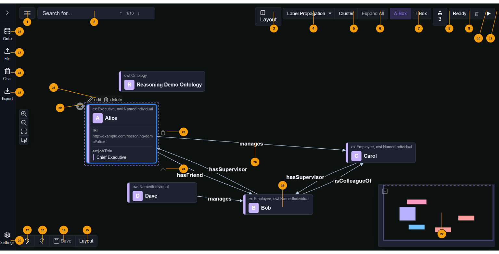

VisGraph — interactive RDF / ontology canvas

Overview
---------
VisGraph is a lightweight interactive editor for RDF knowledge graphs and ontologies. It visualizes RDF subjects as nodes and predicates as edges, provides simple editing (add nodes, create links, edit node/link properties), and integrates basic reasoning to surface inconsistencies. The canvas is implemented with React Flow and connects to an in-browser RDF manager so you can load, inspect, and persist triples directly from the UI.

Key capabilities
----------------
- Load RDF/Turtle/JSON-LD content from local files or remote URLs.
- Startup URL support: open the app with a URL parameter to auto-load an RDF file (see "Startup / URL usage" below).
- Editable canvas: add nodes, create edges, edit node annotation properties and link predicates.
- TBox / ABox views: toggle between ontology-level (TBox) entities and data-level (ABox) entities.
- Layout controls: apply deterministic Dagre layouts (horizontal / vertical) and fit view.
- Export the current graph as Turtle, RDF/XML (OWL) or JSON-LD.
- Developer-friendly diagnostics and an initializer exposed on window for scripted startup.

Quick start (development)
-------------------------
1. Install dependencies (if not already):
   npm install
2. Start the Vite dev server:
   npm run dev
3. Open the app in your browser:
   http://localhost:8080/

Startup / URL parameters
------------------------
VisGraph supports several URL query parameters that control what is loaded on startup.

### RDF data URL

| Parameter | Aliases | Description |
|-----------|---------|-------------|
| `rdfUrl`  | `url`, `vg_url` | HTTP(S) URL of an RDF resource to load into the data graph on startup. |

The loader accepts any of the three aliases; `rdfUrl` is preferred.

**What can be loaded:**

1. **Plain RDF files** — Turtle (.ttl), N-Triples (.nt), N3, RDF/XML, JSON-LD. The format is detected from the `Content-Type` response header and from the file extension / content.

   ```text
   ?rdfUrl=https://example.org/mydata.ttl
   ```

2. **SPARQL endpoints** — URLs whose path ends with `/sparql` or `/query` are recognised automatically. VisGraph runs a `CONSTRUCT { ?s ?p ?o } WHERE { { ?s ?p ?o } UNION { GRAPH ?g { ?s ?p ?o } } }` query to retrieve all triples from both the default graph and all named graphs.

   ```text
   ?rdfUrl=https://example.org/fuseki/$/sparql
   ```

3. **Fuseki / CKAN Fuseki proxy root** — The Fuseki dataset root endpoint (e.g. `/fuseki/$/`) returns the full dataset. VisGraph remaps all named-graph quads into the data graph so they appear on the canvas.

   ```text
   ?rdfUrl=https://docker-dev.iwm.fraunhofer.de/dataset/<uuid>/fuseki/$/
   ```

Named-graph information from TriG or N-Quads responses is intentionally flattened into the single data graph so that all triples are visible on the canvas regardless of their original graph assignment.

### Authentication (API key)

| Parameter | Default | Description |
|-----------|---------|-------------|
| `apiKey`  | —       | Value sent as an authentication header with the RDF fetch request. |
| `apiKeyHeader` | `Authorization` | Name of the HTTP header used to send the API key. |

Use these to access private datasets that require token-based authentication (e.g. CKAN API keys, Bearer tokens).

```text
?rdfUrl=https://docker-dev.iwm.fraunhofer.de/dataset/<uuid>/fuseki/$/
&apiKey=<your-ckan-api-key>
```

```text
?rdfUrl=https://private-endpoint.example.org/data.ttl
&apiKey=Bearer+my-token
&apiKeyHeader=Authorization
```

The API key is sent only with the RDF fetch request(s). CORS: the receiving server must echo the request origin in `Access-Control-Allow-Origin` and set `Access-Control-Allow-Credentials: true` when an `Authorization` header is present — a wildcard `*` origin is incompatible with authenticated requests.

**CKAN + Fuseki setup notes:**
- Log into CKAN, navigate to your profile and copy your API key.
- The dataset must have been loaded into Fuseki via the CKAN Fuseki plugin.
- The nginx CORS configuration must whitelist the VisGraph origin (see pmd-ckan nginx config).

### Full example (CKAN private dataset via Fuseki SPARQL)

```text
http://docker-dev.iwm.fraunhofer.de:8080/
  ?rdfUrl=https://docker-dev.iwm.fraunhofer.de/dataset/<uuid>/fuseki/$/sparql
  &apiKey=<ckan-api-jwt-token>
```

Or via the Fuseki root (returns full dataset as RDF):

```text
http://docker-dev.iwm.fraunhofer.de:8080/
  ?rdfUrl=https://docker-dev.iwm.fraunhofer.de/dataset/<uuid>/fuseki/$/
  &apiKey=<ckan-api-jwt-token>
```

### Other startup mechanisms

- `window.__VG_STARTUP_TTL` — inline Turtle string loaded before any URL parameter.
- `window.__VG_STARTUP_URL` — programmatic URL override (takes precedence over `rdfUrl`).
- `VITE_STARTUP_URL` environment variable — build-time default startup URL.

For safety the loader only accepts `http(s)` URLs. Local filesystem paths are not loaded automatically.

Reasoning demo
--------------
The reasoning demo ontology showcases OWL-RL inference directly in the browser. Load it via the live GitHub deployment:

https://thhanke.github.io/visgraph/?rdfUrl=https://raw.githubusercontent.com/ThHanke/visgraph/refs/heads/main/public/reasoning-demo.ttl

The demo ontology (`public/reasoning-demo.ttl`) defines a small employee hierarchy (Person → Employee → Manager → Executive) and includes ABox assertions that drive five distinct inference patterns:

1. **Inferred object property via rdfs:subPropertyOf** — `ex:hasFriend` is a sub-property of `ex:knows`, so asserting `alice hasFriend bob` causes the reasoner to infer `alice knows bob`.
2. **Inferred object property via owl:inverseOf** — `ex:isManagedBy` is the inverse of `ex:manages`, so asserting `alice manages carol` causes the reasoner to infer `carol isManagedBy alice`.
3. **Inferred object property via owl:SymmetricProperty** — `ex:isColleagueOf` is symmetric, so asserting `bob isColleagueOf carol` causes the reasoner to infer the reverse direction.
4. **Inferred object property via owl:TransitiveProperty** — `ex:hasSupervisor` is transitive, so `bob → alice` and `alice → dave` causes the reasoner to infer `bob → dave`.
5. **Inferred node type via rdfs:domain** — `ex:dave` has no explicit `rdf:type`, but because he is the subject of `ex:manages` (which has domain `ex:Manager`), the reasoner infers `dave rdf:type ex:Manager`.

Click **Run reasoning** in the toolbar to apply OWL-RL inference and watch new (dashed) edges appear. Running it a second time is idempotent — no further changes occur.

CORS and proxies
----------------
- The app fetches remote RDF directly from the browser. If the remote host does not allow cross-origin requests (CORS), the browser will block the fetch.
- If you encounter CORS errors, one of these workarounds helps:
  - Use a CORS-enabled hosting for the TTL file.
  - Use a local dev proxy that forwards the request (configure your dev server if needed).

Using the UI
------------
The annotated diagram below identifies the numbered UI elements described in this section.



Toolbar (① – ⑨, top bar spanning the full width):

① Add Node — opens a dialog to create a new RDF node by full IRI or prefixed name (e.g. ex:Alice).
   The RDF manager expands known prefixes automatically.

② A-Box view — switches the canvas to show ABox individuals (data instances). Active by default.

③ T-Box view — switches the canvas to show TBox entities: classes and properties. Useful for
   inspecting the ontology structure independently of the instance data.

④ Legend — toggles the namespace colour key. Each namespace prefix is assigned a distinct colour
   used for node borders and edge labels throughout the canvas.

⑤ Cluster expand — expands or collapses all node clusters on the canvas at once. The indicator
   shows how many clusters are currently collapsed.

⑥ Ontologies — shows the number of ontologies currently loaded and the number configured in
   settings. Click to open the ontology manager. Ontologies can also be auto-loaded on startup
   via the rdfUrl URL parameter (see "Startup / URL usage" above).

⑦ Layout toggle — enables automatic layout and opens the algorithm selector. Available algorithms
   include Dagre (horizontal / vertical) and ELK variants. When enabled the canvas re-positions
   nodes deterministically on every graph update.

⑧ Reasoning indicator — shows whether OWL-RL reasoning has been applied to the current graph.
   Click it to open the reasoning report, which lists all inferred triples grouped by inference rule.

⑨ Run reasoning — triggers the OWL-RL reasoner over all loaded graphs. Inferred triples are added
   to the store and displayed as dashed edges on the canvas. Running it again is idempotent.

Sidebar icon buttons (⑩ – ⑭, top of the left panel):

⑩ Onto — opens the ontology loader. You can load ontologies by entering any HTTP(S) URL directly,
   or choose from the list of URLs pre-configured in application settings.

⑪ File — opens a file picker to load a local RDF file from disk. Supported formats: Turtle (.ttl),
   JSON-LD (.jsonld), RDF/XML (.rdf / .owl), and N-Triples (.nt).

⑫ Clear — removes all loaded graphs and resets the canvas to an empty state.

⑬ Export — exports the current graph in the chosen serialisation format: Turtle, OWL-XML, or
   JSON-LD. The download is generated entirely in the browser.

⑭ Settings — opens the application settings panel where you can configure default layout,
   clustering algorithm, ontology URLs for auto-loading, and other preferences.

Sidebar content (⑮):

⑮ Workflows panel — lists reusable workflow templates. Drag a template card onto the canvas to
   instantiate it as a connected subgraph. Templates describe multi-step data-processing patterns.

Canvas elements (⑯ – ⑲):

⑯ Cluster handle — the coloured badge at the top of a node that belongs to a cluster. Click it to
   expand or collapse the cluster, revealing or hiding the member nodes grouped under it.

⑰ Individual node — represents an RDF subject. The header shows the local name (IRI), a coloured
   type badge (OWL class), and the annotation properties (rdfs:label, custom annotations) in a
   table below. Double-click to open the node editor.

⑱ Edge / predicate — an arrow connecting two nodes, labelled with the RDF predicate. Dashed edges
   indicate inferred triples produced by the OWL-RL reasoner. Double-click to edit the predicate.

⑲ Minimap — a small overview of the entire graph in the bottom-right corner of the canvas. Click
   anywhere on the minimap to jump to that area, or drag the viewport rectangle to pan.

Canvas interactions:
- Double-click a node to open the node editor (edit labels and annotation properties).
- Double-click an edge to edit its predicate or properties.
- Drag from a node handle to another node to create a new edge (a dialog confirms the predicate).
- Use the zoom controls or scroll to zoom; drag the background to pan.
- Use the fit-view button in the controls panel to reset the viewport to show all nodes.

Developer utilities (window globals)
------------------------------------
- window.__VG_INIT_APP() — initialize loading programmatically.
- window.__VG_APPLY_LAYOUT('horizontal'|'vertical') — apply programmatic layout.
- window.__VG_ALLOW_PERSISTED_AUTOLOAD — opt in to persisted autoload behavior.
- window.__VG_STARTUP_TTL — inline TTL content to load on startup.
- window.__VG_STARTUP_URL — explicit startup URL override.

Troubleshooting
---------------
- If rdfUrl doesn't load on open:
  - Confirm the URL is percent-encoded in the browser address bar.
  - Open DevTools → Network and check the fetch request and response headers.
  - Look for CORS errors (Access-Control-Allow-Origin).
  - Check console logs for RDF parser errors or application diagnostics.
- If you see server-side 403 when you include certain query param names:
  - Some dev servers may intercept/reserve certain query names. Using ?rdfUrl=... avoids common reserved names.

Contributing / Development notes
-------------------------------
- Source files: src/components/Canvas/ReactFlowCanvas.tsx and related components in src/components/Canvas/.
- Tests are in src/__tests__ (unit & e2e).
- Use "npm run dev" to run locally, and run test scripts with npm test (project tests may be configured in package.json).

License & authors
-----------------
Check the repository root for license and contributor information.
